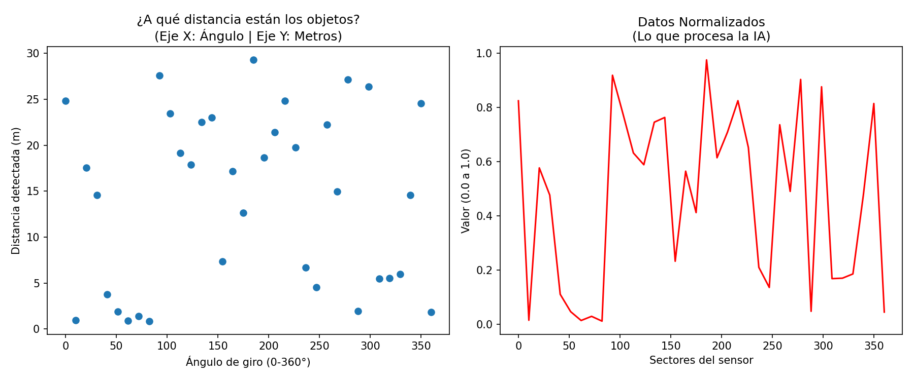
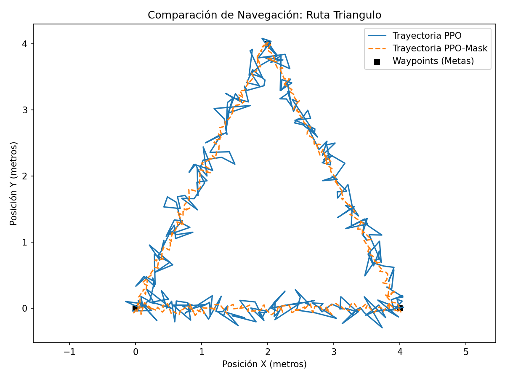
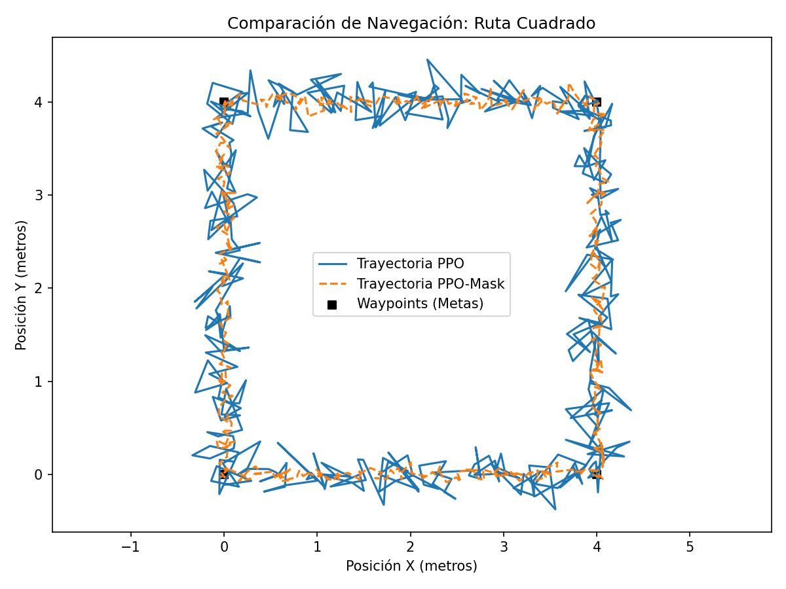
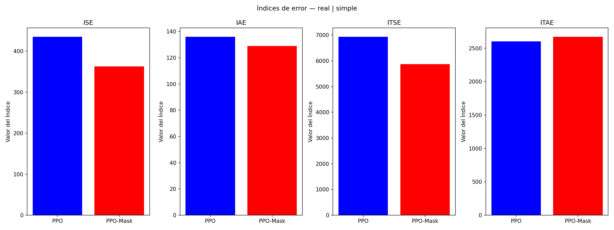

# 🤖 Tarea 1: Sistema de Análisis Robótico

Este proyecto implementa un sistema modular en Python para analizar y visualizar el desempeño de políticas de navegación robótica (PPO vs PPO-Mask), replicando los resultados obtenidos en el paper de referencia.

---

## 📚 1. Análisis del Paper (Cuestionario Teórico)
*(Nota: La versión oficial y evaluada de este cuestionario se encuentra en el archivo [Analisis de paper.pdf](./Analisis%20del%20paper.pdf) adjunto en este repositorio).*

**1. ¿Qué problema del mundo real motiva el desarrollo de este trabajo?**
> *Respuesta:* La motivación principal que tiene este trabajo es poder resolver la crisis medioambiental que generan los residuos plásticos en océanos y zonas costeras. Las soluciones que se presentan a este problema no son tan efectivas como se necesita, ya que los métodos de limpieza manuales son poco eficientes y necesitan mucha mano de obra, como también que los robots industriales existentes suelen ser máquinas grandes que pesan varias toneladas, lo que las hace costosas, gastan demasiada energía y difíciles de utilizar en entornos costeros diversos. Además, existen problemas con respecto a las tecnologías utilizadas en las plataformas robóticas además del costo, los cuales son la baja efectividad en suelo de grano como la arena y la interferencia de la luz solar en los sensores, por lo que se buscan plataformas robóticas más ligeras, económicas y eficientes que utilicen algoritmos como el DRL.

**2. Identifique los sensores equipados en el robot. ¿Cuál es la justificación técnica?**
> *Respuesta:* El robot está equipado con sensores de bajo costo que consiste principalmente en un sensor RPLIDAR S2 (LiDAR 2-D) para la percepción del entorno y la detección de obstáculos, y codificadores ópticos (encoders) en los motores de las ruedas, necesarias para obtener la odometría necesaria para la navegación. Según el artículo, estos sensores fueron elegidos por su bajo costo, la robustez en exteriores, pudiendo operar bajo la luz solar directa, polvo y superficies de arena reflectantes, además de que las deficiencias de estos sensores se pueden resolver mediante los algoritmos DRL.

**3. Explique la diferencia arquitectónica o algorítmica fundamental entre PPO y PPO-Mask.**
> *Respuesta:* La diferencia algorítmica fundamental entre PPO y PPO-Mask está en el cálculo matemático de las probabilidades para elegir las acciones. Mientras el PPO normal evalúa y permite la selección de cualquier acción en el espacio, el PPO-Mask cambia los puntajes (logits) de las acciones que no son viables para el estado actual del robot. El algoritmo resta una constante muy grande a los logits de las acciones inválidas antes de aplicar la función matemática softmax. Esta resta garantiza que la probabilidad de seleccionar una acción imposible se reduzca a cero, disminuyendo los errores de precisión. Las ventajas de esta máscara de acciones son trayectorias más estables y directas, ejecutar las rutas en una menor cantidad de tiempo y utilizando menos pasos de control, además no se desperdicia tiempo con comandos inútiles, dando mayores recompensas (visto en el paper) acumuladas y una curva de aprendizaje mucho más estable.

**4. ¿Qué magnitud física o tipo de comportamiento penaliza de mayor manera el índice ISE?**
> *Respuesta:* El ISE (Integral del Error Cuadrático) se define matemáticamente como la integral del cuadrado del error a lo largo del tiempo. En la navegación robótica descrita en el paper, el error representa la distancia instantánea entre el centro del robot y el punto al que se quiere llegar. Debido a que el ISE se eleva el error al cuadrado, la magnitud física o el comportamiento que más se penaliza son las grandes desviaciones espaciales o errores de gran magnitud. Esto significa que el ISE castiga de manera desproporcionada comportamientos como movimientos que alejan mucho al robot de la ruta ideal o pasarse de largo al intentar dar una curva pronunciada como se ve en las pruebas simuladas y reales del paper.

---

## 🏗️ 2. Comprensión de la Arquitectura Modular

En proyectos de ingeniería, dividir el código es fundamental para la mantenibilidad y escalabilidad. Basándonos en la investigación solicitada, aplicamos los siguientes conceptos:

* **Módulos:** Cualquier archivo `.py` que contiene funciones, clases o variables enfocadas en una tarea específica para ser reutilizadas. En este proyecto, archivos como `metricas.py` y `cinematica.py` actúan como módulos independientes.
* **Paquetes y `__init__.py`:** Un paquete es un directorio que agrupa módulos relacionados. El archivo `__init__.py` es indispensable para que Python reconozca estas carpetas (`data`, `processing`, `visualization`) como paquetes importables.
* **La sentencia `import`:** Es la herramienta que nos permite conectar la lógica distribuida en los paquetes con el archivo orquestador (`main.py`), permitiendo un flujo de trabajo organizado y limpio.

---

## 📁 3. Estructura del Directorio
El código está orquestado por `main.py` y respeta estrictamente la arquitectura modular obligatoria definida en el enunciado, integrando el informe teórico requerido:

```text
tarea1_robot_beach/
├── main.py                 # Punto de entrada: orquesta, no calcula
├── README.md               # Documentación: modularidad y dependencias
├── Analisis de paper.pdf   # Informe teórico (Parte 1)
├── data/                   # Datos del paper y generación de señales
│   ├── __init__.py
│   └── robot_data.py       
├── processing/             # Motor matemático y físico
│   ├── __init__.py
│   ├── metricas.py         # Cálculo de IAE, ISE, ITAE, ITSE
│   └── cinematica.py       # Modelo cinemático del robot
├── visualization/          # Comunicación visual
│   ├── __init__.py
│   └── graficos.py         # Generación de figuras con Matplotlib
└── resultados_graficos/    # Directorio destino para guardar los .png
```

## 📊 4. Resultados Obtenidos

A partir de la ejecución de nuestro código, obtuvimos las siguientes visualizaciones, las cuales se almacenan automáticamente en el directorio `/resultados_graficos`:

### 📡 Simulación Sensorial (LiDAR)

Muestra la percepción del entorno mediante el sensor RPLIDAR S2, fundamental para la navegación en entornos costeros.

<div align="center">
  
</div>

### 📍 Comparación de Trayectorias de Navegación

En esta sección se contrastan las rutas ejecutadas por el robot para los dos escenarios de prueba definidos en el proyecto.

| Trayectoria Triangular | Trayectoria Cuadrada |
| :---: | :---: |
|  |  |

### 📈 Evaluación de Desempeño (Métricas de Error)

Gráfico comparativo de los índices **ISE, IAE, ITSE e ITAE** para las políticas PPO y PPO-Mask, permitiendo visualizar la reducción de error mencionada en el paper (16.6% en ISE).

<div align="center">
  
</div>
